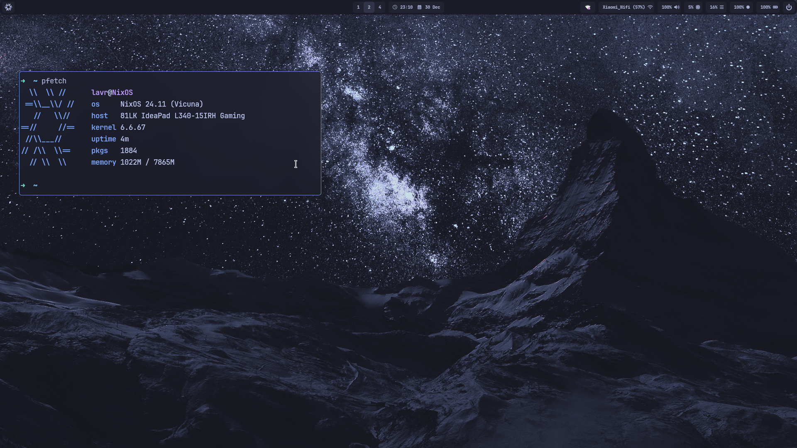

<div align="center"></div>
<h1 align="center">MaxMur ❄️ NixOS Public Configuration</h1>
<div align="center">


</div>

```bash
git clone https://github.com/StasLavr/NixOS-Conf.git
mv nixos-config $HOME/nix # Config is supposed to be in the ~/nix directory
cd $HOME/nix
sudo nixos-rebuild switch --flake .#NixOS
home-manager switch --flake .#lavr
```



## Programs

The `home.nix` file contains details about all the software I use, but here's a shout-out to the ones I use the most and that are customized to my needs.

| Type           | Program      |
| :------------- | :----------: |
| Editor         | Visual Studio Code & NeoVim |
| Launcher       | Rofi |
| Shell          | Fish |
| Status Bar     | Waybar |
| Terminal       | Kitty |
| Window Manager | Hyprland |

## Themes

| Type           | Name      |
| :------------- | :----------: |
| GTK Theme      | Tokyonight-Storm-BL-LB  |
| GTK Icon Theme | Flat-Remix-Blue-Dark |
| Terminal Font  | JetBrainsMono Nerd Font |


